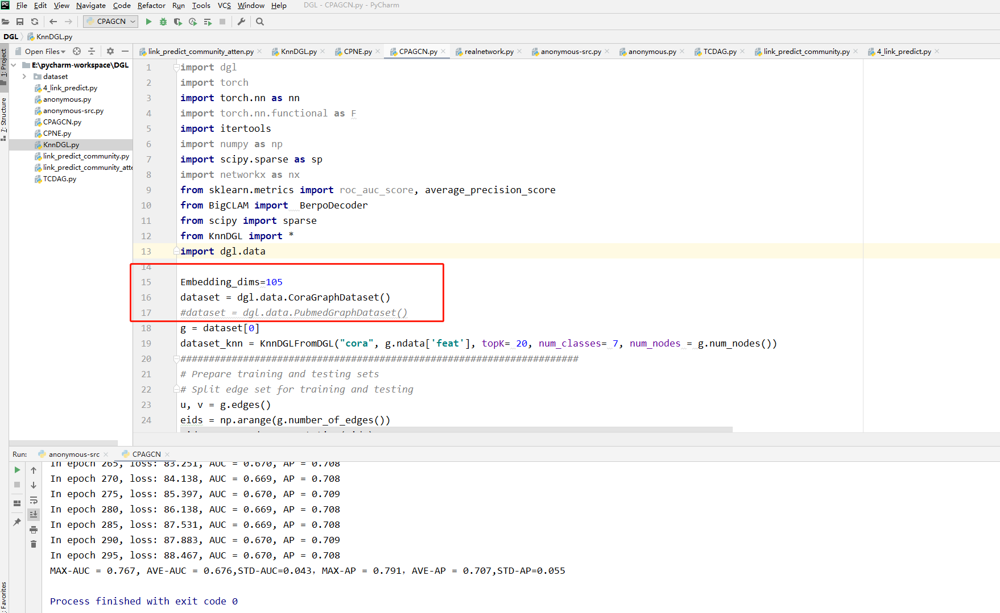

The source code of paper titled "Community preserving adaptive graph convolutional networks for link prediction in attributed networks"  submitted to IEEE Transactions on Neural Networks and Learning Systems

Note that it should install Deep Graph Library (DGL) https://www.dgl.ai/ before running. To test it quickly, you can directly use network datasets of DGL like this:

  

